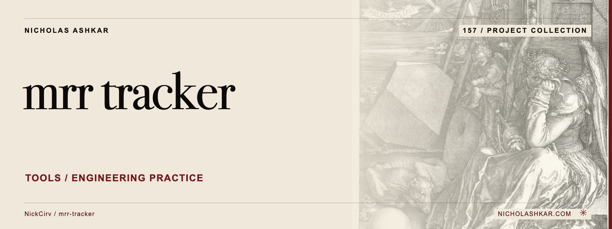

# mrr-tracker

Keep a small, local record of subscription revenue and churn for a side project or early SaaS product.

The CLI records revenue events in `~/.mrr-tracker.json` and derives MRR, ARR, product subscriber counts and milestone progress from that file.


<a id="install"></a>

## Quickstart

Package runtime requirement: Node.js `>=20`. Git is needed to obtain this pinned source checkout.

```bash
git clone https://github.com/NickCirv/mrr-tracker.git
cd mrr-tracker
git checkout e9d76b79b5a5834a75b8848962e1cc4d09f9fa06
node index.js dashboard
```

This source-derived example has not been executed in this review. The dashboard reads the local ledger; an absent ledger starts with empty data. This command does not connect to a billing provider.


<a id="what-it-does"></a>

## Usage

```bash
node index.js add --name "Example SaaS" --amount 29 --type monthly
node index.js churn --name "Example SaaS"
node index.js log
node index.js milestone
node index.js status
```

`add` accepts `monthly`, `yearly` or `once`, plus optional `--customer`. Both `add` and `churn` modify the home-directory JSON file.

[Command reference](docs/REFERENCE.md) covers arguments, modes and output controls.

## Behavior and limits

This is a manually maintained ledger, not an accounting or billing reconciliation system. Currency display is hard-coded to dollars. Subscriber and churn calculations depend on the event history and product-level counts; there is no independent validation against payments. Back up the JSON file before editing it.

## Development

Declared package scripts:

| Script | Command |
| --- | --- |
| `test` | `node --test` |

The smoke test syntax-checks the entrypoint; it does not exercise CLI behavior or integrations.

## Research

[Source review and claim ledger](docs/RESEARCH.md) records revision `e9d76b79b5a5`, inspected files and verification gaps.

## License and attribution

Protected license and attribution files remain unchanged: [LICENSE](https://github.com/NickCirv/mrr-tracker/blob/e9d76b79b5a5834a75b8848962e1cc4d09f9fa06/LICENSE).

[Artwork credits](assets/nicholas-ashkar/CREDITS.md) · [Nicholas Ashkar — consulting](https://nicholashkar.com/#oxblood-contact)
